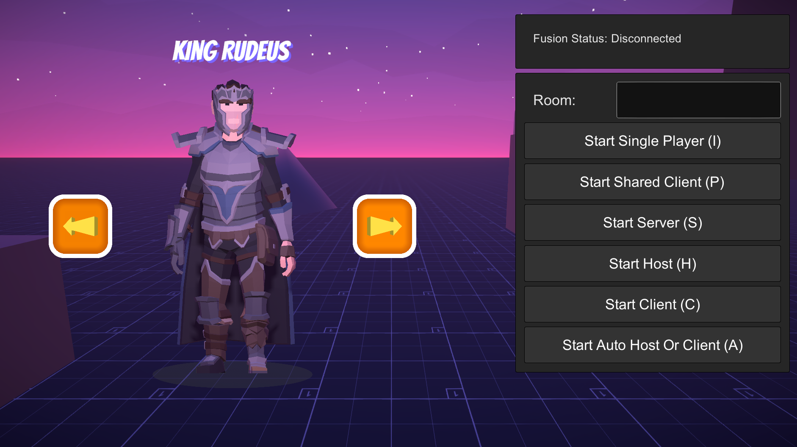

# Unity Movement System with Photon Fusion 2

## Overview

  
   
  <strong style="font-size: 32px;">
    Bill
    The
    Dev
</strong>

This project implements a character movement system with multiplayer support using Photon Fusion 2's KCC (Kinematic Character Controller). The implementation follows the requirements for a Unity Developer test, featuring smooth movement, character customization, and multiplayer capabilities.

## Features

1. **Character Controller**
   - Smooth WASD/arrow key movement
   - Mouse-based rotation
   - Jumping (spacebar)
   - Sprint functionality (shift key)
   - Physics-based movement with proper weight and feel
   - Implemented using Photon Fusion 2's KCC

2. **Multiplayer Implementation**
   - Built with Photon Fusion 2 in Shared Mode
   - Real-time movement synchronization
   - Multiple players in same session
   - Player-controlled characters

3. **Character Customization**
   - 7 Different Characters

4. **Models & Assets**
   - 4 KayKit models (chibi-style with single mecanim)
   - 3 Synty models (with advanced mecanim - locomotion)

## Screenshots

  
  
  

  
  
  
  
  
  

## Technical Specifications
- **Unity Version**: 2022.3.50f1
- **Rendering**: Universal Render Pipeline (URP)
- **Networking**: Photon Fusion 2 (Shared Mode with KCC)
- **Input System**: Unity New Input System
- **Camera**: Custom camera implementation

## Setup Instructions

1. Clone or download the project
2. Or download the latest build from [Releases](https://github.com/billtruong003/jmancurly-test/releases/tag/PhotonFusion2)
3. Open with Unity 2022.3.50f1
4. Import any required dependencies
5. Configure Photon App ID in NetworkRunnerManager
6. Open and play the main scene to test locally

## For Evaluators / Judges - Quick Start & Testing Guide

Thank you for taking the time to evaluate this project! To quickly test the multiplayer functionality, please follow these steps:

1.  **Download and Extract Release Build:** For the fastest testing experience, please download the latest release build from the [Releases](https://github.com/billtruong003/jmancurly-test/releases/tag/PhotonFusion2) section of this repository. Extract the downloaded archive to a folder on your computer.

2.  **Code Structure (Optional Review):** If cloning the entire repository is time-consuming, you can review the code structure directly within the GitHub repository. The project is organized for clarity, making it easy to navigate the different components.

3.  **Local Multiplayer Testing (Simulating Players):** To simulate a multiplayer environment for testing purposes, you can open **2 to 4 tabs or windows** of the game application.  This is especially effective if you're using a WebGL build or a standalone build that allows multiple instances to run.

4.  **Testing "Shared Client (P)" Mode:**
    *   In **one** of your game tabs/windows, select **"Start Shared Client (P)"** from the main menu.
    *   In the **remaining tabs/windows**, also select **"Start Shared Client (P)"**.
    *   **Join Order Recommendation:** It's generally recommended to have **one tab initiate "Start Shared Client (P)" first**, and then have the other tabs join afterwards. This can sometimes improve connection stability in local testing.

5.  **Potential Character Visibility Issue (Rare):** In rare cases, especially on certain systems, you might encounter a situation where players joining a "Shared Client (P)" session do not immediately see other characters. If this occurs, simply **close and reopen the affected game tab/window**. This usually resolves the character visibility issue.

By following these steps with multiple game instances on your local machine, you can quickly evaluate the real-time movement synchronization and multiplayer capabilities implemented in this project using Photon Fusion 2's Shared Mode.

Thank again, and hope that I gave you a nice experience! (˵ ͡° ͜ʖ ͡°˵)

---

## Concise Multiplayer Mode Descriptions (for all players)

Here are brief descriptions of each multiplayer mode in the game menu:

**Start Single Player (I): Single Player (Offline).**  Offline, single-player game mode. No network connection, no other players.

**Start Shared Client (P): Shared Client (Shared Mode Client).**  *Special mode for development and testing.* Connects to a running **Shared Mode** game session (can be on another machine or local for testing). **Does not create a separate server.** Multiple "Shared Clients" can connect to **the same Shared Mode session.** **For developers, not for typical players.** Used for:
    *   Quickly testing multiplayer features.
    *   Network debugging.
    *   Running Fusion demo examples.

**Start Server (S): Dedicated Server (Dedicated Server).**  Creates a **separate, dedicated game server**.  Server runs independently, no player directly on the server. **For large-scale online games, requiring stable, 24/7 servers.** Other players will connect to this server.

**Start Host (H): Host & Play (Host Mode).**  **Most common way to create multiplayer games for typical players.** Your computer acts as **both game server and player.** You create a game room, and others connect to your computer to play together. **Easy to set up, suitable for playing with friends, medium-scale games.**

**Start Client (C): Join Player (Client Mode).**  **Joins a game created by someone else (Host or Dedicated Server).**  You connect to a running game server. **For players who want to join online games hosted by others, without server management.**

**Start Auto Host Or Client (A): Auto (Auto Mode).**  **Fusion automatically chooses whether you are Host or Client.**  Searches for an existing game room to join (Client). If none found, automatically creates a new room and you are the Host. **Fastest way to get into online games, no need to choose mode.**

---
## More of my products

If you're interested in seeing more of my work, you can check out these projects and resources:

*   **[Spaceship Modular Project](https://billthedevlab.com/):** Explore a modular spaceship project showcasing advanced 3D modeling and design.
*   **[3000 Sketchfab Model Scraping Project](https://billthedev.online/):** Discover a project involving the scraping and organization of 3000 models from Sketchfab, demonstrating web scraping and data handling skills.
*   **[SpellTech-Storage - 3D Model Web Storage (GitHub)](https://github.com/billtruong003/SpellTech-Storage):**  View the source code for SpellTech-Storage, a web-based 3D model storage platform similar to Sketchfab, featuring Augmented Reality (AR) capabilities for web-based object viewing.
*   **[Responsive WebGL Template for Unity](https://github.com/billtruong003/Responsive-WebGL-Template):** A Unity WebGL template that provides responsive scaling and full-screen support for WebGL builds, ensuring your WebGL games look great on any browser and device.
*   **[BillTheDev's Portfolio Website](https://billthedev.com):**  (Remember to replace with your actual main portfolio link if you have one, otherwise remove this line) Visit my portfolio website to see a wider range of my game development projects, including demos, videos, and more detailed information about my skills and experience.

This is just a small selection of my work. I am always exploring new technologies and creating exciting projects. Feel free to connect with me on [LinkedIn](https://www.linkedin.com/in/billtruong003/) or reach out through my [portfolio website](www.billthedev.com) to discuss potential collaborations or opportunities.
## Implementation Notes

- Character movement uses Photon Fusion 2's KCC for smooth, reliable movement
- Two character model types:
  - KayKit models: Simpler chibi-style with single mecanim controller
  - Synty models: More detailed with advanced animation system
- Custom camera implementation for proper third-person perspective
- Network synchronization via Photon Fusion 2 in Shared Mode

---

*This project was created as part of a technical assessment for a Unity Developer position.*
